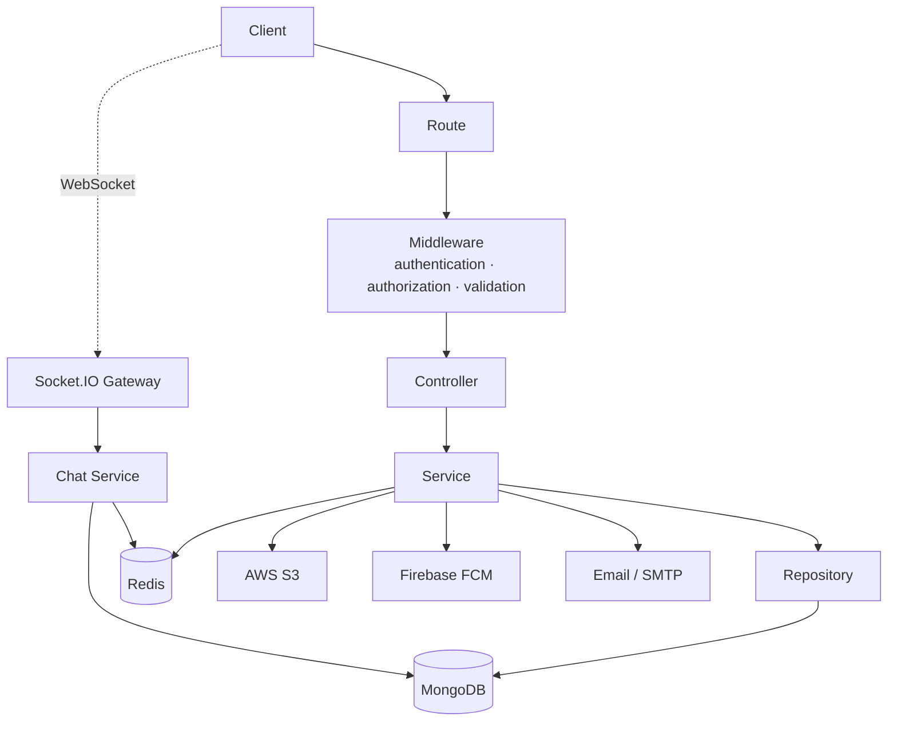

# Social Media Backend API

A modular social media backend built with **Node.js, Express 5, TypeScript and MongoDB**.
It exposes a **REST API** and a **GraphQL endpoint**, uses **Socket.IO** for real-time chat, **Redis** for short-lived state, **AWS S3** for media storage and **Firebase Cloud Messaging** for push notifications.


---

## Table of Contents

1. [Features](#features)
2. [Tech Stack & Dependencies](#tech-stack--dependencies)
3. [Architecture](#architecture)
4. [Project Structure](#project-structure)
5. [Getting Started](#getting-started)
6. [Environment Variables](#environment-variables)
7. [Authentication](#authentication)
8. [REST API Overview](#rest-api-overview)
9. [GraphQL](#graphql)
10. [Real-Time Chat (Socket.IO)](#real-time-chat-socketio)
11. [Data Model & Consistency](#data-model--consistency)
12. [Security](#security)
13. [Known Issues](#known-issues)
14. [Roadmap](#roadmap)
15. [Author](#author)

---

## Features

**Authentication & accounts**
- Sign up / log in with email and password
- Google OAuth (sign up and log in with a Google ID token)
- Email OTP verification, with resend limits and temporary blocking
- Forgot / reset password flow using OTP
- JWT access + refresh tokens, token rotation and revocation (logout from one session or all sessions)
- Role-based authorization (`USER`, `ADMIN`)
- Soft delete, restore and permanent delete for accounts (admin)
- Profile and cover images through S3 pre-signed upload URLs

**Social graph**
- **Follow / unfollow** (independent from friendship), followers and following lists
- **Friend requests**: send, accept, reject, cancel, unfriend, status check, sent / received lists, friends list
- **Block / unblock**: blocking also cleans up friendships, pending requests and follows in both directions

**Content**
- Posts with up to 2 image attachments, update, soft delete, restore, permanent delete
- Post visibility: `PUBLIC`, `FRIENDS`, `ONLY_ME`
- Search posts by content, paginated listing
- Reactions (like, love, laugh, wow, sad, angry, dislike) on posts, comments and replies
- Comments and nested replies, with soft delete / restore
- User mentions and tags (validated against the friendship rules)
- Bookmarks (saved posts) and reposts

**Notifications**
- Persistent in-app notifications: list, unread list, unread count, mark all as read, delete, restore
- Push notifications through Firebase Cloud Messaging; invalid or expired device tokens are removed automatically

**Chat**
- Real-time one-to-one and group chat over Socket.IO
- Group management: create (with optional icon), update name and description, add / remove members, leave, delete
- Groups can only include the creator's active friends

---

## Tech Stack & Dependencies

### Core technologies

| Category | Technology | Used for |
|---|---|---|
| Runtime | **Node.js** (v20 or later) | Server runtime |
| Language | **TypeScript** | Type-safe code, compiled to CommonJS with `tsc` |
| Web framework | **Express 5** | REST API and routing |
| Database | **MongoDB** + **Mongoose 9** | Main database and ODM (with transactions) |
| Cache / state | **Redis** | OTP, revoked tokens, FCM device tokens, socket sessions |
| Real-time | **Socket.IO** | Chat and presence events |
| Query layer | **GraphQL** (`graphql` + `graphql-http`) | Alternative read/write API for selected resources |
| Object storage | **AWS S3** | Profile images, post media, group icons |
| Push notifications | **Firebase Cloud Messaging** (`firebase-admin`) | Mobile / web push |
| Email | **Nodemailer** | OTP emails |
| Social login | **Google OAuth** (`google-auth-library`) | Sign in with Google |
| Validation | **Zod** | Body, query, params and socket payload validation |
| Auth | **JSON Web Tokens** + **bcrypt** | Sessions and password hashing |

### Runtime dependencies

| Package | Purpose |
|---|---|
| `express` | HTTP server and routing |
| `mongoose` | MongoDB models, queries and transactions |
| `redis` | Redis client |
| `socket.io` | WebSocket server for real-time features |
| `graphql` | GraphQL schema and types |
| `graphql-http` | GraphQL HTTP handler for Express |
| `jsonwebtoken` | Signing and verifying JWTs |
| `bcrypt` | Password hashing |
| `zod` | Schema validation |
| `multer` | Multipart / file upload handling |
| `nodemailer` | Sending emails |
| `google-auth-library` | Verifying Google ID tokens |
| `@aws-sdk/client-s3` | S3 client |
| `@aws-sdk/lib-storage` | Multipart uploads to S3 |
| `@aws-sdk/s3-request-presigner` | Pre-signed upload / download URLs |
| `firebase-admin` | Sending FCM push notifications |
| `cors` | CORS middleware |
| `dotenv` | Loading `.env.*` files |
| `cross-env` | Cross-platform `NODE_ENV` |

### Development dependencies

| Package | Purpose |
|---|---|
| `typescript` | Compiler (`tsc`) |
| `concurrently` | Runs the compiler and the server together |
| `@types/*` | Type definitions (`express`, `node`, `multer`, `jsonwebtoken`, `bcrypt`, `nodemailer`) |

> Exact versions are pinned in [`Code/package.json`](Code/package.json).

---

## Architecture

The project is organized into feature modules. Each request goes through routing, middleware, a controller, a service and a repository before reaching MongoDB.



**Design principles**

- **Separation of concerns:** controllers handle HTTP, services hold business rules, repositories wrap Mongoose.
- **Validation first:** every request is validated with Zod before it reaches the service layer.
- **Centralized error handling:** custom exceptions are converted into a consistent JSON response by a global error middleware.
- **Reusable services:** shared logic (tokens, Redis, S3, notifications, mentions) lives in `common/services`.

**Successful response shape**

```json
{
  "message": "Done",
  "status": 200,
  "data": {}
}
```

---

## Project Structure

```text
Social-Media-App/
├── Code/
│   ├── src/
│   │   ├── main.ts                    # Entry point
│   │   ├── app.bootstrap.ts           # Express app, routes, DB / Redis / Socket.IO startup
│   │   ├── config/
│   │   │   └── config.ts              # Reads environment variables
│   │   ├── DB/
│   │   │   ├── connection.db.ts       # MongoDB connection
│   │   │   ├── model/                 # Mongoose models
│   │   │   └── repository/            # Repositories (data access layer)
│   │   ├── common/
│   │   │   ├── enums/
│   │   │   ├── exceptions/            # Custom application exceptions
│   │   │   ├── interfaces/
│   │   │   ├── response/              # successResponse helper
│   │   │   ├── services/              # token, redis, s3, notification, mention
│   │   │   ├── types/
│   │   │   ├── utils/                 # email, multer, security (hash / encryption), otp
│   │   │   └── validation/            # shared Zod fields
│   │   ├── middleware/                # authentication, authorization, validation, error handler
│   │   └── modules/
│   │       ├── auth/
│   │       ├── user/                  # + gql/
│   │       ├── post/                  # + gql/
│   │       ├── comment/
│   │       ├── follow/
│   │       ├── friendRequest/
│   │       ├── block/
│   │       ├── bookmark/
│   │       ├── repost/
│   │       ├── notification/
│   │       ├── chat/                  # + realtime/ (Socket.IO events)
│   │       ├── realtime/              # Socket.IO gateway
│   │       └── graphql/               # Root GraphQL schema
│   ├── package.json
│   └── tsconfig.json
└── README.md
```

Most modules follow the same layout:

```text
module/
├── <module>.controller.ts   # routes / HTTP layer
├── <module>.service.ts      # business logic
├── <module>.validation.ts   # Zod schemas
└── index.ts
```

---

## Getting Started

### Prerequisites

- **Node.js 20+** and npm
- **MongoDB** running as a **replica set** (required for transactions, see below)
- **Redis**
- An **AWS S3** bucket and IAM credentials
- A **Firebase** project with a service account (for push notifications)
- A **Google OAuth** web client ID (for Google login)
- An email account / app password for sending OTP emails

### 1. Clone and install

```bash
git clone https://github.com/Habiba-50/Social-Media-App.git
cd Social-Media-App/Code
npm install
```

### 2. Configure environment variables

Create `.env.development` (and `.env.production` if needed) inside the `Code/` folder. See [Environment Variables](#environment-variables) for the full list.

> The app loads the env file relative to the **current working directory**, so always run the commands from inside `Code/`.

### 3. Add the Firebase service account

1. In the Firebase Console go to **Project settings → Service accounts → Generate new private key**.
2. Save the downloaded JSON file inside `Code/src/config/`.
3. Make sure the file name matches the path used in `src/common/services/notification.service.ts`, or update that path to your file name.

Service account files are ignored by git (`/Code/src/config/*.json`). Never commit them.

### 4. Start MongoDB as a replica set

Multi-document transactions only work on a replica set. **MongoDB Atlas** already provides one. For a local instance:

```bash
mongod --replSet rs0
# in another terminal:
mongosh --eval "rs.initiate()"
```

Then use a connection string such as `mongodb://127.0.0.1:27017/social-media?replicaSet=rs0`.

### 5. Start Redis

Run Redis locally (default `redis://127.0.0.1:6379`) or use a hosted instance, and put its URL in `REDIS_URL`.

### 6. Build and run

```bash
# compile TypeScript once
npx tsc

# development (watches TypeScript and restarts the server)
npm run start:dev

# production environment file
npm run start:prod
```

| Script | What it does |
|---|---|
| `npm run start:dev` | Sets `NODE_ENV=development`, runs `tsc --watch` and `node --watch dist/main.js` |
| `npm run start:prod` | Same as above with `NODE_ENV=production` (loads `.env.production`) |

The server starts on `PORT` (default `7000` when not set). Open `http://localhost:<PORT>/` to see the landing message.

---

## Environment Variables

| Variable | Required | Description |
|---|---|---|
| `PORT` | No | HTTP port (defaults to `7000`) |
| `APPLICATION_NAME` | Yes | Application name (used in emails) |
| `DB_URI` | Yes | MongoDB connection string (replica set) |
| `REDIS_URL` | Yes | Redis connection URL |
| `SALT_ROUND` | No | bcrypt salt rounds (defaults to `10`) |
| `ENCRYPTION_KEY` | Yes | Secret used for AES-256 encryption of sensitive fields (e.g. phone number) |
| `IV_LENGTH` | No | IV length for encryption (defaults to `16`) |
| `EMAIL_APP` | Yes | Sender email address |
| `EMAIL_PASS` | Yes | Email app password |
| `User_JWT_SECRET` | Yes | Signing secret for **user** access tokens |
| `User_REFRESH_JWT_SECRET` | Yes | Signing secret for **user** refresh tokens |
| `System_JWT_SECRET` | Yes | Signing secret for **admin / system** access tokens |
| `System_REFRESH_JWT_SECRET` | Yes | Signing secret for **admin / system** refresh tokens |
| `ACCESS_EXPIRES_IN` | No | Access token lifetime in **seconds** (defaults to `3600`) |
| `REFRESH_EXPIRES_IN` | No | Refresh token lifetime in **seconds** (defaults to `86400`) |
| `WEB_CLIENT_ID` | Yes (for Google login) | Google OAuth web client ID |
| `AWS_REGION` | Yes | S3 region |
| `AWS_BUCKET_NAME` | Yes | S3 bucket name |
| `AWS_ACCESS_KEY_ID` | Yes | AWS access key |
| `AWS_SECRET_ACCESS_KEY` | Yes | AWS secret key |
| `AWS_EXPIRES_IN` | Yes | Pre-signed URL lifetime in seconds |
| `ORIGINS` | No | Comma-separated list of allowed origins |
| `facebookLink`, `instegram`, `twitterLink` | No | Social links shown in the email template |

Example `.env.development`:

```env
# Application
PORT=3000
APPLICATION_NAME="Social Media App"

# Databases
DB_URI="mongodb://127.0.0.1:27017/social-media?replicaSet=rs0"
REDIS_URL="redis://127.0.0.1:6379"

# Hashing & encryption
SALT_ROUND=12
ENCRYPTION_KEY="change-me"

# Email
EMAIL_APP="your-email@example.com"
EMAIL_PASS="your-app-password"

# JWT (use long, random and different values for each secret)
User_JWT_SECRET="change-me"
User_REFRESH_JWT_SECRET="change-me"
System_JWT_SECRET="change-me"
System_REFRESH_JWT_SECRET="change-me"
ACCESS_EXPIRES_IN=1800
REFRESH_EXPIRES_IN=31536000

# Google OAuth
WEB_CLIENT_ID="your-google-web-client-id"

# AWS S3
AWS_REGION="us-east-1"
AWS_BUCKET_NAME="your-bucket"
AWS_ACCESS_KEY_ID="your-access-key"
AWS_SECRET_ACCESS_KEY="your-secret-key"
AWS_EXPIRES_IN=120
```

> **Never commit real credentials.** `.env.*` files and Firebase key files must stay out of version control.

---

## Authentication

The API uses two token types, both signed as JWTs:

- **Access token**: short-lived, used for normal requests.
- **Refresh token**: long-lived, used only to get a new pair of tokens.

Tokens are issued with an audience (`USER` or `SYSTEM`), so admin and user tokens are signed with different secrets.

Send the access token in the `Authorization` header **as the raw token, without a `Bearer` prefix**:

```http
Authorization: <access_token>
```

**Typical flow**

1. `POST /auth/signup` → an OTP is emailed to the user.
2. `PATCH /auth/confirm-email` with the OTP → account is activated.
3. `POST /auth/login` → returns `access_token` and `refresh_token` (optionally send an `fcm` device token to receive push notifications).
4. When the access token is about to expire, call `POST /user/rotate-token` with the **refresh token** in the `Authorization` header. The old token is revoked and a new pair is returned. (The API rejects rotation while the access token still has more than 5 minutes left.)
5. `POST /user/logout` with `flag: "one"` to end the current session, or `flag: "all"` to end all sessions.

Revoked tokens are tracked in Redis using each token's `jti`.

---

## REST API Overview

All routes below require authentication unless stated otherwise. Request and response details (bodies, params, examples) are documented in the Postman collection:

**[API Documentation on Postman](https://documenter.getpostman.com/view/40942955/2sBYB4K6GW)**

### Auth: `/auth`

| Method | Endpoint | Description |
|---|---|---|
| POST | `/auth/signup` | Register with email and password |
| PATCH | `/auth/confirm-email` | Confirm email with OTP |
| PATCH | `/auth/resend-otp` | Resend the OTP |
| POST | `/auth/login` | Log in |
| POST | `/auth/signup/gmail` | Sign up with a Google ID token |
| POST | `/auth/login/gmail` | Log in with a Google ID token |
| POST | `/auth/forgot-password-otp` | Send a password reset OTP |
| POST | `/auth/verify-otp-password` | Verify the reset OTP |
| PATCH | `/auth/reset-password` | Set a new password |

### User: `/user`

| Method | Endpoint | Description |
|---|---|---|
| GET | `/user` | Get my profile |
| GET | `/user/:userId` ⚠️ | Get another user's profile by ID — see [Known Issues](#known-issues) |
| POST | `/user/rotate-token` | Rotate tokens (refresh token required) |
| POST | `/user/logout` | Log out (`one` / `all`) |
| PATCH | `/user/profile-image-URL` | Get a pre-signed URL to upload a profile image |
| PATCH | `/user/profile-image/confirm` | Confirm the uploaded profile image |
| PATCH | `/user/cover-images` | Upload cover images |
| PATCH | `/user/update` | Update profile information |
| GET | `/user/searchUser` | Search users |
| DELETE | `/user/delete/:userId` | Soft delete an account |
| PATCH | `/user/restore/:userId` | Restore an account |
| GET | `/user/all` · `/user/active` · `/user/deleted` ⚠️ | List users (admin) — currently unreachable, see [Known Issues](#known-issues) |
| DELETE | `/user/destroy/:userId/permanent` | Permanently delete a user (admin) |

### Posts: `/post`

| Method | Endpoint | Description |
|---|---|---|
| POST | `/post` | Create a post (up to 2 image attachments) |
| PATCH | `/post/:postId` | Update a post |
| PATCH | `/post/:postId/react` | React to a post |
| GET | `/post` | List / search posts (paginated) |
| GET | `/post/:id` | Get a post |
| DELETE | `/post/:id` | Soft delete a post |
| PATCH | `/post/restore/:id` | Restore a post |
| DELETE | `/post/destroy/:id` | Permanently delete a post |

### Comments: `/post/:postId/comment`

| Method | Endpoint | Description |
|---|---|---|
| POST | `/` | Create a comment |
| POST | `/:commentId/reply` | Reply to a comment |
| GET | `/:commentId` | Get a comment with its replies |
| PATCH | `/:commentId` | Update a comment |
| PATCH | `/:commentId/react` | React to a comment |
| PATCH | `/:commentId/reply/:replyId/react` | React to a reply |
| DELETE | `/:commentId` | Soft delete a comment |
| PATCH | `/:commentId/restore` | Restore a comment |
| DELETE | `/:commentId/destroy` | Permanently delete a comment |

### Follow: `/follow`

| Method | Endpoint | Description |
|---|---|---|
| POST | `/follow/:followingId` | Follow a user |
| DELETE | `/follow/:followingId` | Unfollow a user |
| GET | `/follow/followers` | My followers |
| GET | `/follow/following` | Users I follow |
| GET | `/follow/status/:followingId` | Follow status |

### Friend requests: `/friend-request`

| Method | Endpoint | Description |
|---|---|---|
| POST | `/friend-request/:receiverId` | Send a friend request |
| PATCH | `/friend-request/:requestId/accept` | Accept |
| PATCH | `/friend-request/:requestId/reject` | Reject |
| PATCH | `/friend-request/:requestId/cancel` | Cancel a sent request |
| PATCH | `/friend-request/:personId/unfriend` | Unfriend — pass the **other user's ID** (not the friend request ID) |
| GET | `/friend-request/:friendId/status` | Friendship / request status |
| GET | `/friend-request/requests-sent` | Pending requests I sent |
| GET | `/friend-request/requests-received` | Pending requests I received |
| GET | `/friend-request/my-friends` | My friends |

### Block: `/block`

| Method | Endpoint | Description |
|---|---|---|
| POST | `/block/:blockedId` | Block a user |
| PATCH | `/block/:blockedId` | Unblock a user |
| GET | `/block` | My blocked users |
| GET | `/block/:blockedId` | Check whether a user is blocked |

### Bookmarks: `/bookmark` and Reposts: `/repost`

| Method | Endpoint | Description |
|---|---|---|
| POST | `/bookmark/:postId` | Save a post |
| PATCH | `/bookmark/:postId` | Remove a saved post |
| GET | `/bookmark` | My saved posts |
| GET | `/bookmark/:postId` | Check whether a post is saved |
| POST | `/repost/:postId` | Repost a post |
| DELETE | `/repost/:repostId` | Undo a repost |
| GET | `/repost/my-reposts` | My reposts |
| GET | `/repost/:postId` | Reposts of a post |

### Notifications: `/notification`

| Method | Endpoint | Description |
|---|---|---|
| GET | `/notification` | All notifications |
| GET | `/notification/unread` | Unread notifications |
| GET | `/notification/unread/count` | Unread count |
| GET | `/notification/:notificationId` | One notification |
| PATCH | `/notification/mark-all-as-read` | Mark all as read |
| DELETE | `/notification/:notificationId` | Delete one |
| DELETE | `/notification` | Delete all |
| PATCH | `/notification/restore/:notificationId` | Restore one |
| PATCH | `/notification/restore-all` | Restore all |

Notification types: `LIKE`, `COMMENT`, `REPLY`, `TAG`, `MENTION`, `POST`, `FOLLOW`, `FRIEND_REQUEST`, `REPOST`, `GROUP_ADD`, `NEW_LOGIN`.

### Chat: `/user/chat`

| Method | Endpoint | Description |
|---|---|---|
| GET | `/user/:userId/chat` | One-to-one conversation with a user |
| GET | `/user/chat/my-chats` | My conversations |
| POST | `/user/chat/group` | Create a group |
| GET | `/user/chat/group/:groupId` | Get a group conversation |
| PATCH | `/user/chat/group/:groupId/update` | Update group name / description (admin only) |
| PATCH | `/user/chat/group/:groupId/add-member` | Add a member |
| PATCH | `/user/chat/group/:groupId/remove-member/:memberId` | Remove a member |
| PATCH | `/user/chat/group/:groupId/leave` | Leave a group |
| PATCH | `/user/chat/group/:groupId/delete` | Delete a group |

### Files

| Method | Endpoint | Description |
|---|---|---|
| GET | `/uploads/*` | Stream a stored file from S3 (`?download=true&filename=...` to download) |
| GET | `/pre-signed/*` | Get a pre-signed download URL for a stored file |

---

## GraphQL

Endpoint: `POST /graphql` (requires the same `Authorization` header as the REST API).

| Type | Field | Description |
|---|---|---|
| Query | `profile` | Get a user profile |
| Query | `postList` | Get a paginated list of posts |
| Mutation | `reactOnPost` | React to a post |

Schemas, argument definitions, types and resolvers live next to their modules in `modules/user/gql` and `modules/post/gql`, and are combined in `modules/graphql/schema.gql.ts`.

---

## Real-Time Chat (Socket.IO)

Socket.IO runs on the same HTTP server. Connections are authenticated with the same access token, and each user's active socket IDs are stored in Redis so messages reach every connected device.

**Connecting**

```js
import { io } from "socket.io-client";

const socket = io("http://localhost:3000", {
  auth: { token: "<access_token>" },
});
```

**Events**

| Direction | Event | Payload | Description |
|---|---|---|---|
| Client → Server | `sendMessage` | `{ sendTo, content }` | Send a one-to-one message |
| Client → Server | `sendGroupMessage` | `{ groupId, content }` | Send a message to a group |
| Client → Server | `join_room` | `{ roomId }` | Join a group room |
| Server → Client | `newMessage` | `{ content, sendTo / groupId, from }` | A message received from another user |
| Server → Client | `successMessage` | `{ content, ... }` | Delivery confirmation to the sender's sockets |
| Server → Client | `user_offline` | `{ user }` | A user's last socket disconnected |
| Server → Client | `message_edited` | `{ chatId, messageId, content }` | Pushed to the other participants when a message is edited (via `PATCH` on the REST API) |
| Server → Client | `message_deleted` | `{ chatId, messageId }` | Pushed to the other participants when a message is deleted (via `DELETE` on the REST API) |
| Server → Client | `custom_error` | error | Validation or business-rule error |

**Group rules**

1. Participant IDs are normalized and de-duplicated.
2. Participants must exist and be active.
3. Every participant must have an accepted friendship with the creator.

---

## Data Model & Consistency

**Main collections:** `User`, `Post`, `Comment`, `Follow`, `FriendRequest`, `Block`, `Bookmark`, `Repost`, `Notification`, `Chat` (with embedded messages).

Relationships are stored in **their own collections** instead of large arrays inside the user document, and the user document keeps counters (`followersCount`, `followingCount`, `friendsCount`) that are updated together with the relationship.

- **Follow:** a unique compound index prevents duplicate follow records.
- **Friend requests:** a single `FriendRequest` document tracks the state: `PENDING`, `ACCEPTED`, `REJECTED`, `CANCELLED`, `UNFRIENDED`.
- **Block:** a unique index on `(blockerId, blockedId)`.
- **Soft delete:** users, posts, comments, notifications and chats use `deletedAt` / `restoredAt` fields.

**MongoDB transactions** are used wherever several writes must succeed or fail together:

| Operation | Written together |
|---|---|
| Accept friend request / unfriend | FriendRequest + both users' `friendsCount` |
| Follow / unfollow | Follow + follower's `followingCount` + target's `followersCount` |
| Block | Block + friendship cleanup + follow cleanup in both directions |
| Permanent post deletion | Post + all of its comments (S3 files are deleted after the commit) |

**S3 consistency:** when a database write fails after files were uploaded, the service deletes the uploaded files to avoid orphaned objects.

---

## Security

Implemented in the codebase:

- Password hashing with **bcrypt**
- **JWT** access and refresh tokens with separate secrets for users and admins
- Refresh token **rotation** and **revocation** through Redis (`jti` blacklist)
- **Role-based authorization** middleware (`USER`, `ADMIN`)
- Email **OTP** stored hashed in Redis with an expiry, resend limits and temporary blocking after too many requests
- **AES-256** encryption for sensitive fields (phone number)
- **Zod** validation for bodies, queries, params and socket payloads
- File filtering by MIME type (JPEG / PNG images, MP4 video) on uploads
- Centralized error handling with custom exceptions
- Secrets loaded from environment files; `.env.*` and Firebase key files are git-ignored

---

## Known Issues

These were found while reviewing the latest changes and should be fixed before relying on the affected endpoints.

1. **`GET /user/all`, `/user/active`, `/user/deleted` and `/user/searchUser` are currently unreachable.**
   The new `GET /user/:userId` route is registered *before* these routes in `user.controller.ts`. Express matches routes in the order they are declared, so a request to `/user/all` is captured by `/:userId` (with `userId = "all"`) and never reaches the admin route.
   **Fix:** move `GET /user/:userId` below the literal routes (`/all`, `/active`, `/deleted`, `/searchUser`, `/update`, ...), or mount it at a more specific path.

2. **`GET /user/:userId` returns the full user document, including the password hash.**
   The handler calls `userRepository.findById()` with no projection, and the `password` field has no `select: false` in the schema. Any authenticated user can fetch another user's bcrypt hash (and other private fields) by ID.
   **Fix:** either add `select: false` to `password` in `user.model.ts`, or pass an explicit projection (e.g. exclude `password`, `phone`) in `profileById()`.

---

## Roadmap

Planned improvements:

- Global HTTP rate limiting and security headers (`helmet`)
- Restrict CORS to a list of allowed origins (`ORIGINS`) for both REST and Socket.IO
- Require authentication (or signed URLs only) for `/uploads/*` and `/pre-signed/*`
- Load the Firebase credentials from an environment variable instead of a file path
- Automated tests (unit and integration)
- Message read receipts and typing indicators
- Feed / recommendation logic
- Docker setup and deployment configuration

---

## Author

**Habiba Mohamed**: Full Stack JavaScript Developer, focused on backend development.

- GitHub: [Habiba-50](https://github.com/Habiba-50)
- LinkedIn: [habiba-mohamed-hm](https://www.linkedin.com/in/habiba-mohamed-hm/)
